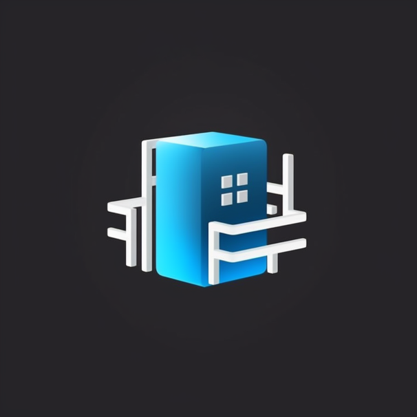

# Roblogic Codespace Template



Roblogic Codespace Template is a comprehensive and customizable template for machine learning and deep learning projects with a focus on Python backend and React frontend development. This template is designed to help developers and researchers quickly set up their work environment and focus on building efficient algorithms and models for their machine learning and deep learning tasks.

## Table of Contents

- [Features](#features)
- [Installation](#installation)
- [Usage](#usage)
- [Customization](#customization)
- [Contributing](#contributing)
- [License](#license)
- [Acknowledgments](#acknowledgments)

## Features

- Pre-configured and customizable development environment for Python backend and React frontend projects
- Code organization best practices
- Supports various machine learning and deep learning libraries and frameworks (TensorFlow, PyTorch, scikit-learn)
- Build automation and continuous integration
- Unit testing and performance benchmarking
- Docker and Kubernetes support for scalable deployment

## Installation

1. Clone the repository

```bash
git clone https://github.com/genome21/ml-dl-codespace-template.git
```

2. Change directory to the project folder

```bash
cd ml-dl-codespace-template
```

3. Install dependencies

```bash
# For Python-based projects
pip install -r requirements.txt

# For React-based projects
cd frontend
npm install
```

## Usage

1. Modify the template to fit your specific project needs (see [Customization](#customization)).
2. Write your machine learning or deep learning code and algorithms in the `src` folder.
3. Add unit tests in the `tests` folder.
4. Use the build system to compile and run your project.

## Customization

This template is built to be easily customizable for a wide range of machine learning and deep learning projects. Here are some steps to help you get started:

1. Update the `README.md` file to reflect your project's description, features, and usage instructions.
2. Adjust the folder structure and namespaces to match your project's requirements.
3. Configure the build system and continuous integration in the `scripts` folder.
4. Modify the Dockerfile and Kubernetes configurations if you are planning to use containerization and orchestration.

## Contributing

Please see the [CONTRIBUTING.md](CONTRIBUTING.md) file for details on how to contribute to this project.

## License

This project is licensed under the MIT License - see the [LICENSE.md](LICENSE.md) file for details.

## Acknowledgments

- The ML-DL Codespace Template is built and maintained by [genome21](https://github.com/genome21) and its contributors.
